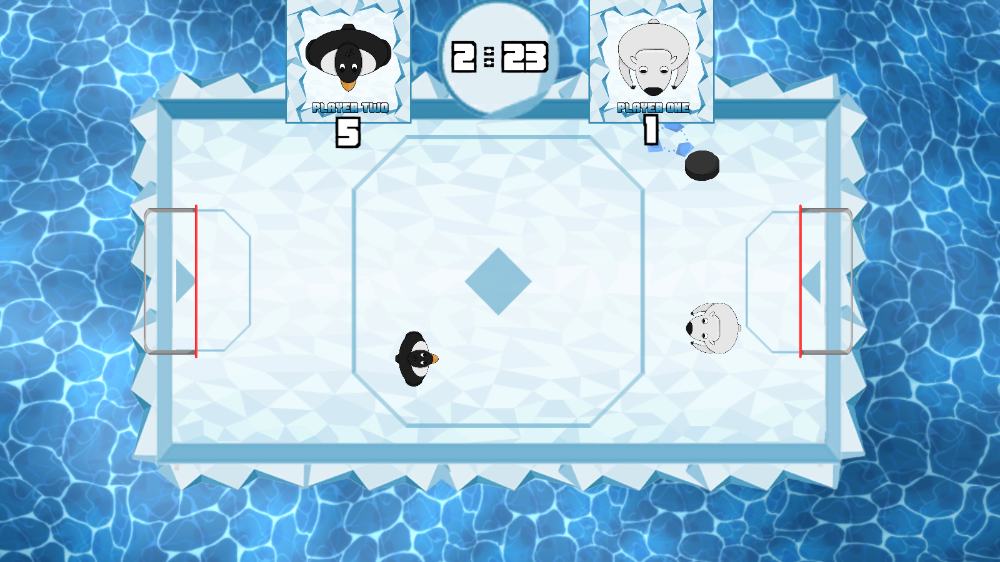
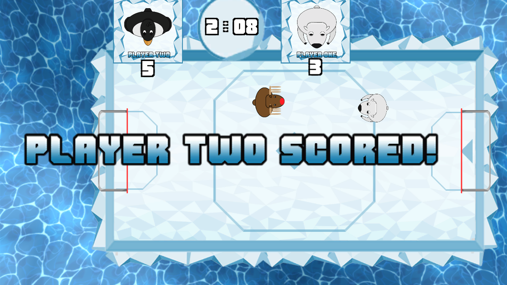
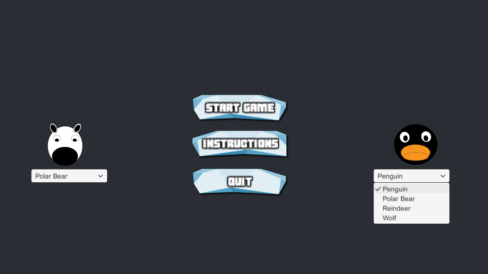
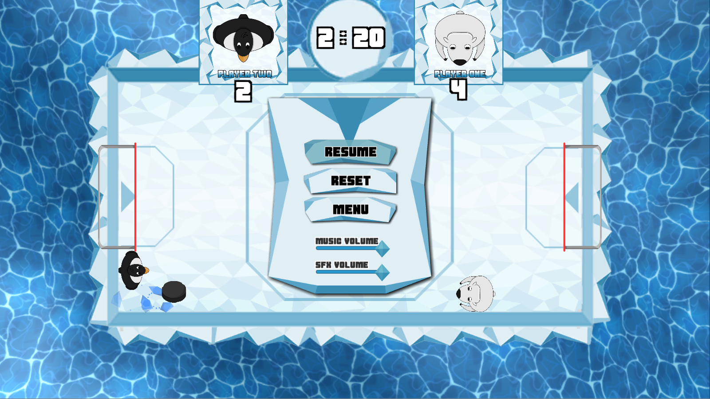

# Group Project L4_5, Group 9, Second Semester

## Team Members:

* **Programmer Level 5 - Charlie Crewe**

* **Designer Level 5 - Jamie Chandler**

* **Designer Level 4 - Mark Key**

* **Designer Level 4 - Thomas Turner**

## Screenshots:

<table>
    <tr>
        <td>
            
        </td>
        <td>
            
        </td>
    </tr>
    <tr>
        <td>
            
        </td>
        <td>
            
        </td>
    </tr>
</table>

## Builds:

Build | Date | Capture
--- | --- | ---
[Prototype_17_03_15](https://github.com/UoSGamesGroups/second-semester-s2-level-4-5-group-9/tree/master/Standalones/Prototype_17_03_15 "Prototype_17_03_15") | 15/03/2017 | [Capture Footage](https://drive.google.com/file/d/0B_ZHkAG62QhCemFGUzgwTllhT1k/view "15/03/17 Capture Footage")
[Prototype_17_03_29](https://github.com/UoSGamesGroups/second-semester-s2-level-4-5-group-9/tree/master/Standalones/Prototype_17_03_29 "Prototype_17_03_29") | 29/03/2017 | TODO
